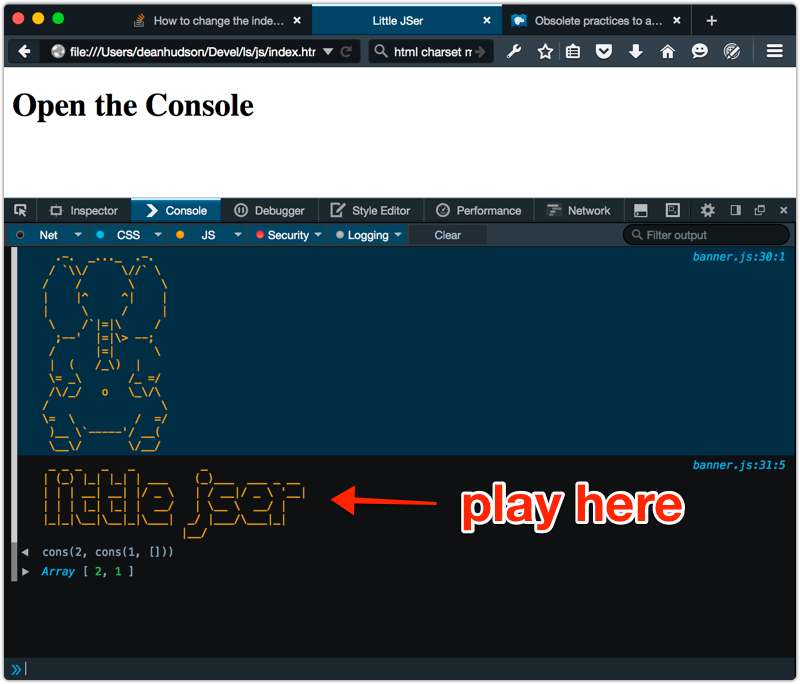

# Little Schemer Book Club

This is the scratch repo for my work in a Little Schemer reading club. The ```racket``` dir
contains chapter by chapter implementations in Racket. The ```js``` dir contains
one large file with functions implemented in JavaScript. JavaScript support should be considered an experimental feature. :)

## Scheming in DrRacket

We define ```atom?``` (which is necessary for the exercises) in ```lib/shared.rkt```. If you open a chapter file in DrRacket, you can access this file by requiring the relative path. Run the code, and play on the REPL.


## Scheming with JS in the Browser

Everything for the JS version is pulled in via script tags in ```index.html```, so you should be able to open the page in your browser and then play in the console.



NOTE: functions are currently exported from simple modules in ```js/little-jser.js``` into the global namespace. Take a look at ```index.html``` and ```js/little-jser.js``` for details.
